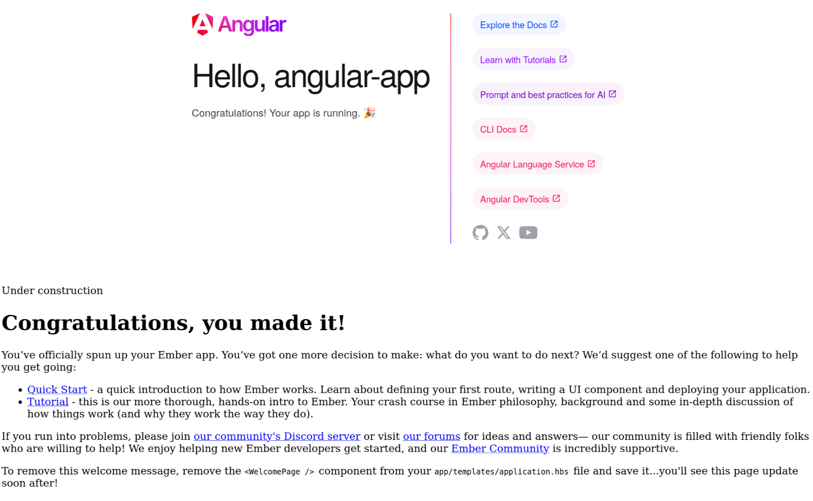

# Vite library mode commit-by-commit

This project is intended for demonstrating the config changes needed to turn a default Ember vite app into a universal library.

## How to use this project

The goal of this project is to import the ember app into the angular app, and render it there without any weird iframe tricks.

In order to simulate a "real" install from the npm registry, the angular app depends on the tarball of the ember project, as generated by the standard `pnpm pack` command.

Start at step 1, and run `pnpm install`.

For each commit in the chain, you can run `pnpm build` in the workspace root to execute a build-pack-install cycle, and then run `pnpm start` to start the angular app.

At some stages, this will intentionally crash or not work properly, in order to demonstrate the problems as we go through each of the required changes step by step.

# Step 1: The beginning

We start with the initial setup: both apps are cleanly generated from their respective CLIs. Run `pnpm install`, followed by `pnpm start` to make sure everything works correctly. The default angular app should start.

# Step 2: naive dependency

We'll first try to naively see if we can import the ember app into angular, in order to understand what library mode is doing for us.

- we add a dependency on the ember project in the angular app
- we try to import something

(Note the build command is now modified to also install the tarball in the angular project. If you haven't ran `pnpm install` at this point, it may fail since it won't find the tarball which the angular project now depends on. Simply run `pnpm emberapp install` first, then `pnpm build`, after which you should be able to run `pnpm install` in the root.)

Starting the angular app now gives us a type error, indicating that typescript does not yet understand the module.

# Step 3: ignore typescript

Let's reduce complexity and ignore typescript for a second, we'll enable it again later. Running `pnpm start` now gives us a more interesting error:

```
An unhandled exception occurred: Failed to resolve entry for package "ember-vite-app". The package may have incorrect main/module/exports specified in its package.json: Missing "." specifier in "ember-vite-app" package
```


If we look in the ember app's package.json, we see it does define an `exports` key, but, as the error above states, it does not have an entry for `.`, aka the bare `ember-vite-app` import specifier.

# Step 4: let's build

We can try to import directly from `ember-vite-app/app.ts`, but that doesn't work either, typescript complains about a bunch of modules it can't find, including some "virtual" embroider modules. Let's drop the naive facade for a second and recognize we obviously need to build the app, trying to import the raw sources won't get us anywhere (although, keep an eye on https://github.com/embroider-build/embroider/pull/2549 , buildless ember may be closer than you'd think!).


We include the dist folder with the `files` key, and point the package json towards the built files. Let's use both `main` and `exports`, even though `exports` alone should be enough in modern times.

... and immediately, we run into a problem. If we look at the files in dist, we that the only js file in there has a UUID in its name. Now, the uuid does seem stable across rebuilds of the same files, so we can assume it's based on a hash of the files, but I cannot guarantee the hash will look the same on your system. 

If it's not, I invite you to change the ember app's package.json config to the correct files to follow along.

Despite this hash looking weird, this setup actually gets past the angular build step!
However, we now get a runtime error in the browser console:

```
Error: 'modulePrefix' is not defined
```

Ooh that's an ember error! We're making progress!

# Step 5: fixing modulePrefix

If we grep our source code, we see that modulePrefix is set on the `App` class in `app.ts`:


```ts
// other imports omitted
import config from 'ember-vite-app/config/environment';

if (macroCondition(isDevelopingApp())) {
  importSync('./deprecation-workflow');
}

export default class App extends Application {
  modulePrefix = config.modulePrefix;
  podModulePrefix = config.podModulePrefix;
  Resolver = Resolver.withModules(compatModules);
}
```

And we also find its definition in `environment.js`:

```js

'use strict';

module.exports = function (environment) {
  const ENV = {
    modulePrefix: 'ember-vite-app',
    environment,
    rootURL: '/',
    locationType: 'history',
    // etc...

```

So there seems to be something broken with that import. However, it's really just a string value, so let's just repeat that string in `app.ts`

Now we get a different error: 

```
TypeError: can't access property "onUpdateURL", e2 is undefined
```

# Step 6: disabling routing

If we check the stacktrace, we see the error refers to the router. If we think about it, it kinda makes sense that this doesn't work out of the box. A "normal" ember app assumes it has full control over the page, 
including full usage of the "location" api. But now we're running inside angular, which _also_ makes that assumption. It's not immediately clear how routing _should_ even behave in a nested app. There might be more clever ways to make the 
host routing cooperate with ember's routing, but the simplest solution is simply to disable the `location` integration. This disconnects ember's router from the page's uri, which is in most cases what you'd want. You can always let the host 
pass in the current route as an argument (see later when we customize the way we let the host app boot the ember app).

To do this, we need to set the locationType to `none`. Because we lost the connection to `environment.js`, we have to do this directly in `app.ts` and in `router.ts`.

Rebuild... and... hurray! The ember app booted!



That... was fast! Let's recap what we had to do to get here:

- we modified the package.json to point to the built files
- we hardcoded the modulePrefix
- we disconnected ember's router from the page's `location`

We didn't change anything about the build config! If you've tried this before the embroider/vite days, you know that it's far from obvious that this works. It's thanks to the huge effort by the embroider team, and the browser support of es-modules, that this is possible.

# Step 7: making it a library

Of course, this is no way to ship a library. The host app imports some side-effecting file, and the app just renders somewhere on the page! That won't do. Not to mention the fact that I've had to adjust the `package.json` config for every build, since the filenames change every time, and it's getting old.

Let's list what we need the build system to do for us:

- make the built files have stable filenames so we don't have to keep updating our package.json
- make sure anything we export is also exported from the built file

That's not asking much, so any build system will be able to do this. It just so happens vite was selected to receive first-class support from the ember team, and with good reason. Vite takes care of a lot of otherwise confusing configuration for 
bundlers like Rollup and esbuild, and presents a developer-friendly and consistent configuration interface, as well as a unique dev-server. But it's important to remember that that's really all it's doing.


Here's the docs for vite's library mode: https://vite.dev/guide/build.html#library-mode

So let's apply this!

We tell vite to use library mode, and point it directly to `app.ts` as the entrypoint. This will ensure it ignores the `index.html` and just builds the code without wrapping it in a side-effecting module.
We then adjust the package.json one last time. Vite now gives us 2 files by default: an es-module version and a UMD version. This is fantastic, as it ensures compatibility with systems that don't understand es-modules (though, luckily, there's less and less of those around)

Rebuild, and... well it still works, but the ember-app is still booting automatically. Let's fix this next.

# Step 8: letting the host decide when to boot the app


The fact the app automatically boots is another result of the way ember assumes it has control over the entire page. In that situation, there's not much point to _not_ starting the app, so the autoboot default makes sense. 
Luckily, it's easy to turn it off.

While we're at it, let's also slightly improve the interface for our library. We'd like the consuming app to be able to decide when an where to render the ember app. Additionally, we don't want the consumer to have to learn any ember-specific methods
or conventions. So let's wrap up the whole boot process in a simple function we can export.

For clarity, I've implemented this in a separate file, called `main.ts`. This way, we can cleanly separate the wrapping logic with the rest of the app's logic. We just have to adjust the entrypoint to point to this new file.

And lastly, we update the angular app to "properly" instantiate our app, letting it provide us a dom element to render in.

Build... and... hey it broke!


We get a rather useless `TypeError: (void 0) is not a function` error in the browser console, but in our terminal we get a more useful warning:

```
▲ [WARNING] Import "startApp" will always be undefined because the file "../node_modules/.pnpm/ember-vite-app@file+ember-vite-app-latest.tgz/node_modules/ember-vite-app/dist/ember-vite-app.mjs" has no exports 
[import-is-undefined]

    src/app/app.ts:4:9:
      4 │ import { startApp } from 'ember-vite-app';
        ╵          ~~~~~~~~

```

# Step 9: the last gotcha

I admit I don't fully understand why this is necessary, but it turns out our vite config is not _quite_ enough. We also have to explicitly tell rollup about our entrypoint. That's easily done, we just need to add the following lines to the build config:

```
    rollupOptions: {
      input: 'app/main.ts',
    }
```

Hurray! We can see that angular can now decide when and where to render the ember app!

# Step 10: styles and types

Let's finish off the last loose ends: styles and types. You may have spotted that vite already bundles our css for us, into a nice `ember-vite-app.css` bundle. All we have to do to make this bundle available to other apps, is to export it in the package.json.
Important to note here is that you're in full control of how you want to "route" the imports of the consuming app. The way I chose here is just arbitrary, all you need it for the importing app to have a way to get to the right file.


Now, you may be surprised about the change on the angular side - I am too. Now that we're used to vite handling everything through imports, having to adjust some framework-specific config file seems... outdated?
Full disclosure, I don't actually know much about Angular, there might be a better way, but I at least could not find it.

Regardless, you can still see the effect of the "exports" routing we added in the package.json. We can refer to `/styles.css", and it will find the correct file.

Hurray! Styles!


Let's do types next, so we can finally get rid of that ugly `ts-expect-error`. The reason we're not getting any types has, again, actually nothing to do with vite. We... are just not actually making them!

So, let's add a build script that will make the types for us to the `package.json`, and make the plain `build` command run both builders concurrently:

```json
    "build": "concurrently \"pnpm:build:*\" --names \"build:\" --prefixColors auto",
    "build:js": "vite build",
    "build:types": "glint --declaration",
```

We use glint for the types, cause it can handle all the ember-specific syntax and typing needs.

We'll also need to adjust the `tsconfig`, as it's still set up for app usage without emitting types. 

We see that the tsconfig extends from `@ember/app-tsconfig`. There's various approaches: you could look into what that does, and construct your own tsconfig from scratch, or you can just override the relevant keys, which is what we'll do here, but I highly recommend learning about what all the options do.

```json
    "declaration": true,
    "declarationDir": "./dist-types",
    "emitDeclarationOnly": true,
    "noEmit": false,
```

So we tell glint to emit (= compile) files, but only as declarations, since vite already takes care of the rest. Once again, the declarationDir I chose is arbitrary, and you could easily use a subfolder of `dist` or something. I just like to see them side-by-side, makes it easy to see where things are.

Oops, type errors appear! Turns out I never actually typechecked the ember app until this point...

Lets fix them:

The first one already tells us what to do:

```shellsession
[build:types] app/templates/application.gts:4:1 - error TS2742: The inferred type of 'default' cannot be named without a reference to '.pnpm/@glint+template@1.5.2/node_modules/@glint/template/-private/integration'. This is likely not portable. A type annotation is necessary.
[build:types]
[build:types]   4 <template>
[build:types]     ~~~~~~~~~~
[build:types]   5   {{pageTitle "EmberViteApp"}}
[build:types]     ~~~~~~~~~~~~~~~~~~~~~~~~~~~~~~
[build:types] ...
[build:types]  12 </template>
[build:types]     ~~~~~~~~~~~
[build:types]  13
```

We need to add an explicit type annotation. I use `TOC` here, even though this is technically a route... I'm not sure exactly how to type these routes yet.

The next one is a bit of a lame one:

```shellsession
[build:types] app/main.ts:11:5 - error TS2322: Type 'HTMLElement' is not assignable to type 'string | SimpleElement | null | undefined'.
[build:types]   Type 'HTMLElement' is not assignable to type 'SimpleElement'.
[build:types]     Types of property 'nodeValue' are incompatible.
[build:types]       Type 'string | null' is not assignable to type 'null'.
[build:types]         Type 'string' is not assignable to type 'null'.
[build:types]
[build:types] 11     rootElement: element,
[build:types]        ~~~~~~~~~~~
[build:types]
[build:types]   ../node_modules/.pnpm/ember-source@6.7.0_@glimmer+component@2.0.0_rsvp@4.8.5/node_modules/ember-source/types/stable/@ember/engine/instance.d.ts:20:9
[build:types]     20         rootElement?: string | SimpleElement | null;
[build:types]                ~~~~~~~~~~~
[build:types]     The expected type comes from property 'rootElement' which is declared here on type 'BootOptions'
[build:types]
```

We pass an html element to the app, and instead it expects either a queryString or a "SimpleElement", which is some internal Ember type that has way less properties than a real DOM element. Annoyingly, the types are not compatible, but this might be a case where a cast is justified... but of course I'll accept better suggestions!

SimpleElement is not a public type, but with a little trickery, we can easily get at it:

`type SimpleElement = Parameters<App['visit']>[1]['rootElement'];`


Now that we build the type declarations, lets make sure consuming apps can actually find them as well. To the `package.json` once again!


We make sure to include the types now:
```json
  "files": [
    "dist",
    "dist-types"
  ],
```

and then point the exports to the right spots:

```json

  "exports": {
    "./tests/*": "./tests/*",
    "./*": {
      "types": "./dist-types/app/*.d.ts",
      "default": "./app/*"
    },
    ".": {
      "types": "./dist-types/app/main.d.ts",
      "import": "./dist/ember-vite-app.mjs",
      "require": "./dist/ember-vite-app.umd.js"
    },
    "./styles.css": "./dist/ember-vite-app.css"
  },
```

And hurray! Types!

